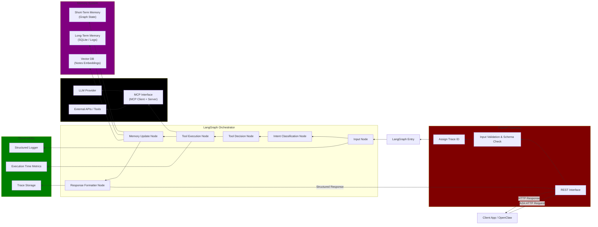

# Overview

```
                 ┌────────────────────┐
                 │     OpenClaw       │
                 │  (Main Agent)      │
                 └─────────┬──────────┘
                           │ A2A Request
                           ▼
                 ┌────────────────────┐
                 │   Personal Agent   │
                 │  (Custom Tools)    │
                 ├────────────────────┤
                 │ - Usage Tracker    │
                 │ - Notes Scanner    │
                 │ - Chat Analyzer    │
                 │ - Prompt Enhancer  │
                 └────────────────────┘
```

**Rudimentatry idea:** 

I have OpenClaw installed but to learn the way *MCP, and multi-agent work*. I want to spawn a personal agent that would be working and be connected with openclaw.
What my personal agent would do?
It would have *custom tools, resources and prompts* to do personal tasks like tracking usage, scanning my notes, analyzing chats and responses I send to a chat, etc.
Basically a newbie agent under openclaw so that I can get work done securely not being exposed to OpenClaw

# Requirements

## Tool Orchestration

Agent must not just call tools — it must:
- Decide when to call tools
- Pass structured arguments in and out
- Return structured results
- Handle tool failure

## Memory System

Agent must manage:

- Short term memory

		- Conversation state
		- Act task state
		
- Long term memory:

		- Notes embedding
		- Past usage logs
		
## Observability

Agent must log its actions:
- A2A requests
- Tool invocations
- Execution time
- Failures

# Security Controls
- Tool access control
- Input validation
- Resource access control

## A2A Protocol 
OpenClaw → http://localhost:8001/agent-task
PersonalAgent → http://localhost:8000/report
Both communicate via `http`


# Architecture

## FastAPI Gateway

Routes the traffic, validates request, assign `trace_id`

## Langraph Orchestrator

- State design
```
state = {
    "task_id": str,
    "trace_id": str,
    "input": dict,
    "intent": str,
    "selected_tool": str,
    "tool_output": any,
    "memory_updates": dict,
    "errors": list,
    "execution_time": float
}
```

## Nodes

- Intent Classifier
- Tool Decision
- Tool Execution
- Memory Update
- Response Formatter

## MCP Layer

Handles tool, resource and prompts access

## Memory System

- Short Term Memory (Langraph State)
- Long Term Memory (SQLite Logs)
- Vector DB (Embeddings)

## Observability

```
{
  "trace_id": "abc123",
  "node": "tool_execution",
  "tool": "usage_analyzer",
  "duration_ms": 42,
  "status": "success"
}
```
A central logging system where all nodes send metrics

## Security Controls

It is implemented across the nodes in the early development phase

- Tool use monitoring
- Input validation

# Workflow Example

```
1. FastAPI receives request from OpenClaw

2. Validates schema

3. Passes to LangGraph (logs send to Observability)

4. Intent classifier detects "analyze_usage"

5. Tool decision selects usage_analyzer

6. Tool executes (logs send to Observability)

7. Reads logs

8. Aggregates stats

9. LLM summarizes pattern

9. Memory node stores summary

10. Response formatter builds structured output to OpenClaw client (logs send to Observability)
```

# Workflow Diagram



